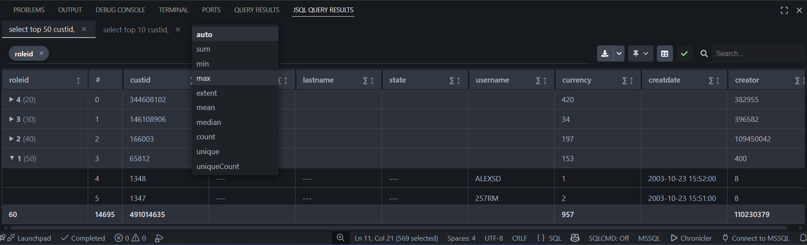

# JSQL Editor

A VS Code extension for Adhoc SQL query with advanced result visualization and analysis features. 

Designed to **work in conjuntion Microsoft's MSSQL extension** (re-use existing connections) - think of it as a re-skin. Additionally, you can configure your own connections independently (supports SQL Server and PostgreSQL) without using _mssql_, but this extension does not come with its own language server.

## Features

### Data Streaming, Multi-Tab Results and Tab Comparison
Execute multiple queries simultaneously and view results in separate tabs with ability to cross-compare. For example, compare SQL Server data with PostgreSQL data.

### Enhanced UI
Modern interface that improves upon the standard MSSQL extension:
- Clean, responsive result tables. One tab per dataset
- Column grouping, global filtering, resizing and sorting
- Export capabilities: Excel, CSV, Markdown, Data Wrangler

### Smart Drill
Auto generate queries based on selected data points to explore related information quickly.

## Requirements
- VS Code 1.99.1 or higher
- For SQL Server: .NET Runtime 8.0 or higher

## Contributing

Contributions are welcome! Please feel free to submit a Pull Request.

## License

MIT License

